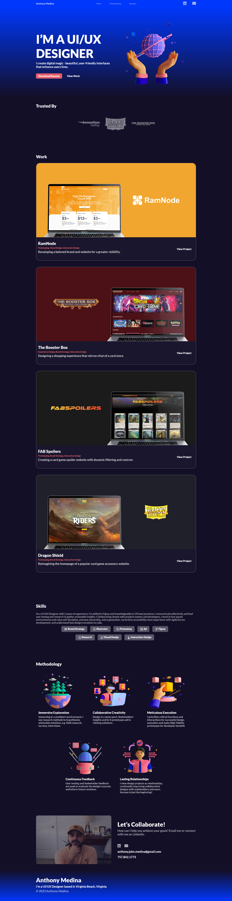
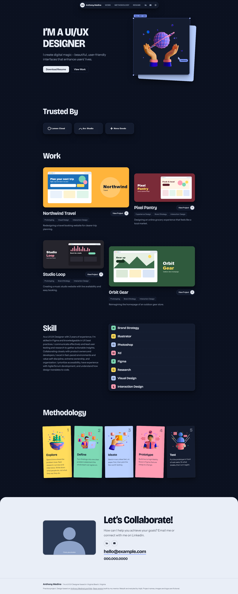

# Anthony Medina Portfolio (Redesign)

A practice project. I redesigned an existing UI/UX designer portfolio using plain HTML, CSS and JavaScript.

## Original Project

- **Original portfolio (base version):** https://anthony-medina-portfolio.netlify.app/
- My mentor gave me this link as a practice task. I rebuilt and restyled it.

## Live Demo

https://portfolio-anthony-medina.netlify.app/

## Before and After

| Before (original) | After (my redesign) |
| :---: | :---: |
|  |  |

## What I Changed

- New color theme and typography (Bricolage Grotesque + Instrument Sans)
- Dark mode toggle, saved in `localStorage`
- Layout rebuilt with Flexbox
- Floating toolbar with active section highlight
- Hero image moves a little with the mouse (parallax)
- Design-tool style labels on images (shows live size)
- Fully responsive (mobile, tablet, desktop)
- Basic accessibility: skip link, alt text, aria labels, reduced motion support

## Sections

1. Hero
2. Trusted By
3. Work
4. Skill
5. Methodology
6. Contact

## Built With

- HTML5
- CSS3 (Flexbox, CSS variables, `@layer`)
- JavaScript (no libraries)
- Font Awesome 6.6.0 (icons)
- Google Fonts

## Project Structure

```
├── index.html
├── stylesheet.css
├── script.js
├── img/
└── README.md
```

## Run Locally

1. Download or clone the repo
2. Open `index.html` in your browser

No install needed.

## Note

This is a practice project, not a real client site. Project names, images and logos (Northwind Travel, Pixel Pantry, Studio Loop, Orbit Gear, Lumen Cloud, Arc Studio, Nova Goods) are fictional. Email and phone are placeholders.

## Credits

- Original portfolio: Anthony Medina ([LinkedIn](https://www.linkedin.com/in/anthonyjmedina/), [GitHub](https://github.com/ajm24027))
- Practice task and base link: my mentor
- Redesign and code changes: **Muhammad Aqib**